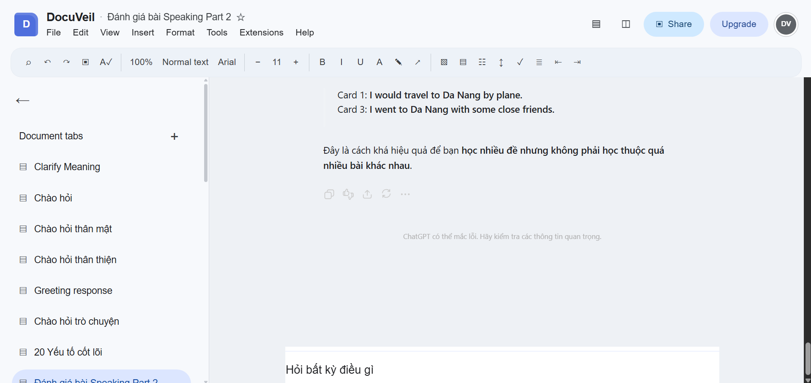

<div align="center">
  

  # DocuVeil

  **A focused, document-style workspace for ChatGPT and Claude.**

  DocuVeil reshapes supported AI chat interfaces into a calm writing environment while preserving each platform's native conversation flow.

  [](https://github.com/CaoRIV/DocuVeil/actions/workflows/ci.yml)
  [](extension/manifest.json)
  [](extension/manifest.json)
  [](#browser-support)
  [](#browser-support)
  [](LICENSE)
</div>

> [!NOTE]
> DocuVeil is currently an MVP distributed as a source build. It supports ChatGPT and Claude Free/Pro personal chats on desktop Google Chrome and Microsoft Edge.

## Overview

Chat interfaces are useful for quick exchanges, but long conversations can become visually noisy and difficult to review. DocuVeil presents the same conversation as a continuous document with familiar editor-style chrome, a dedicated history sidebar, and an inline prompt area.

DocuVeil is a presentation layer—not a replacement chat client. It keeps each platform's native composer, message handling, navigation, and response rendering in place.

## Preview

<p align="center">
  
</p>

<p align="center"><em>DocuVeil presenting a ChatGPT conversation as a focused document workspace.</em></p>

## Current MVP features

- A document-style reading and writing canvas for ChatGPT and Claude conversations.
- A persistent conversation sidebar built from the active platform's native history.
- An inline prompt area that remains part of the document flow.
- Native Claude transcript context and composer behavior remain in place so existing chats,
  text submission, scrolling, and streamed responses continue through Claude's own interface.
- Live UI refreshes while the host platform navigates, replaces page elements, or streams responses.
- Native Claude Artifacts remain visible and interactive.
- A one-click toolbar action to enable or disable DocuVeil.
- Independent ChatGPT and Claude enabled states stored through `chrome.storage.local`.
- A fail-open compatibility mode that leaves the native platform available when its current page structure is unsupported.
- No DocuVeil account, backend, analytics, telemetry, or conversation storage.

## Install and run from source

### Requirements

- [Node.js](https://nodejs.org/) 20 or newer
- npm
- Desktop Google Chrome or Microsoft Edge
- A ChatGPT account or Claude Free/Pro personal account

### 1. Clone and build

```bash
git clone https://github.com/CaoRIV/DocuVeil.git
cd DocuVeil
npm ci
npm run build:extension
```

The unpacked browser extension is generated in `dist/extension`.

### 2. Load the extension

#### Google Chrome

1. Open `chrome://extensions`.
2. Enable **Developer mode**.
3. Select **Load unpacked**.
4. Choose the `dist/extension` directory from this repository.

#### Microsoft Edge

1. Open `edge://extensions`.
2. Enable **Developer mode**.
3. Select **Load unpacked**.
4. Choose the `dist/extension` directory from this repository.

### 3. Use DocuVeil

1. Open [chatgpt.com](https://chatgpt.com/) or [claude.ai](https://claude.ai/).
2. Select the DocuVeil icon in the browser toolbar.
3. Continue using the chat normally inside the document-style interface.
4. Select the icon again whenever you want to return to the native interface.

ChatGPT and Claude are toggled independently, so enabling DocuVeil on one platform does not change the other.

After changing the extension source, rebuild and reload it:

```bash
npm run build:extension
```

Then select **Reload** on the DocuVeil card in `chrome://extensions` or `edge://extensions`, and refresh any open ChatGPT or Claude tabs.

For more detail, see the [installation guide](docs/INSTALL.md).

## Run the website locally

The repository also contains the DocuVeil landing page.

```bash
npm ci
npm run dev
```

Vite prints the local development URL in the terminal. To build and preview the production website:

```bash
npm run build:website
npm run preview
```

## Development

### Useful commands

| Command | Purpose |
| --- | --- |
| `npm run dev` | Start the landing-page development server |
| `npm run build:website` | Build the landing page |
| `npm run build:extension` | Build the unpacked extension into `dist/extension` |
| `npm run build` | Build both the website and extension |
| `npm test` | Run the extension unit and integration tests |
| `npm run test:build` | Validate the generated extension package |
| `npm run lint` | Lint the website and type-check the extension |
| `npm run preview` | Preview the production website build |

Before submitting a change, run:

```bash
npm run lint
npm test
npm run build
npm run test:build
```

### Repository structure

```text
DocuVeil/
├── extension/            # Manifest V3 extension source and tests
│   ├── assets/           # Extension source assets
│   ├── src/
│   │   ├── adapters/     # Platform-specific DOM integration
│   │   ├── background/   # Browser action and persisted state
│   │   ├── content/      # Page lifecycle and presentation controller
│   │   ├── shared/       # Shared contracts and storage helpers
│   │   └── shell/        # DocuVeil workspace chrome
│   ├── styles/           # Document-interface styles
│   └── tests/            # Unit, integration, fixture, and build tests
├── website/              # React and Vite landing page
├── docs/                 # Installation, privacy, security, and contributor docs
└── .github/workflows/    # Continuous integration
```

## How it works

1. The extension toolbar action toggles a locally stored enabled flag for the current platform.
2. A content script detects ChatGPT or Claude and inspects the page through its dedicated platform adapter.
3. When the required native elements are available, DocuVeil applies its document layout and renders its workspace chrome.
4. The host platform retains ownership of the composer, conversation, and Artifact DOM, so native behavior continues to work.
5. Claude transcript, virtual-scroll, and composer layout primitives retain their native
   positioning and flex behavior; DocuVeil applies only the presentation rules required for readability.
6. A scoped observer refreshes DocuVeil when the host platform updates its interface.

## Platform support

| Platform | MVP support |
| --- | --- |
| ChatGPT personal chats | Supported |
| Claude Free/Pro personal chats | Supported |
| Claude Projects and Team/Enterprise layouts | Not currently supported |
| Gemini | Not currently supported |

## Browser support

| Browser | Status |
| --- | --- |
| Google Chrome desktop | Supported for MVP testing |
| Microsoft Edge desktop | Supported for MVP testing |
| Other Chromium browsers | Not currently verified |
| Firefox and Safari | Not currently supported |

## Current limitations

- The extension is installed from source; no browser-store package is available yet.
- ChatGPT and Claude can change their DOM without notice. DocuVeil falls back to the native interface when it cannot safely identify required elements.
- Claude support follows the current personal-chat `transcript-*` DOM structure. Run the
  Chrome and Edge smoke-test checklist again whenever Claude changes its chat or composer interface.
- Claude Projects, Team/Enterprise layouts, Gemini, mobile browsers, and non-Chromium browsers are outside the current MVP scope.

## Privacy

DocuVeil runs locally in the browser and stores only per-platform enabled flags. It does not collect or store prompts, responses, files, cookies, history, or credentials. Conversations remain handled by ChatGPT or Claude under their respective platform terms and privacy policies.

Read the complete [privacy statement](docs/PRIVACY.md).

## Documentation

- [Installation guide](docs/INSTALL.md)
- [Contributing guide](docs/CONTRIBUTING.md)
- [Privacy statement](docs/PRIVACY.md)
- [Security policy](docs/SECURITY.md)
- [Release checklist](docs/RELEASE_CHECKLIST.md)
- [MVP design specification](docs/superpowers/specs/2026-09-06-docuveil-design.md)

## Contributing

Issues and focused pull requests are welcome. Platform-specific selectors belong in their matching directory under `extension/src/adapters/`, and DOM lifecycle changes should include an updated fixture or regression test.

Please read [CONTRIBUTING.md](docs/CONTRIBUTING.md) before opening a pull request.

## Security

Please report vulnerabilities privately through the GitHub security-advisory flow. Do not include credentials, cookies, private conversations, or attachments in reports.

See [SECURITY.md](docs/SECURITY.md) for details.

## Disclaimer

DocuVeil is an independent open-source project. It is not affiliated with, endorsed by, or sponsored by OpenAI, Google, Microsoft, Anthropic, ChatGPT, Chrome, Edge, Claude, or Gemini. Product names are used only to describe compatibility.

## License

DocuVeil is released under the [MIT License](LICENSE).
